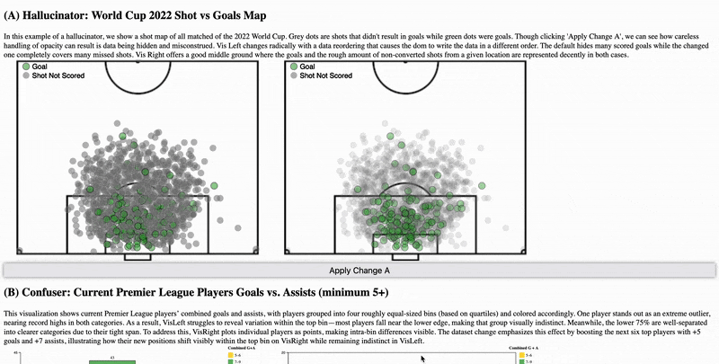
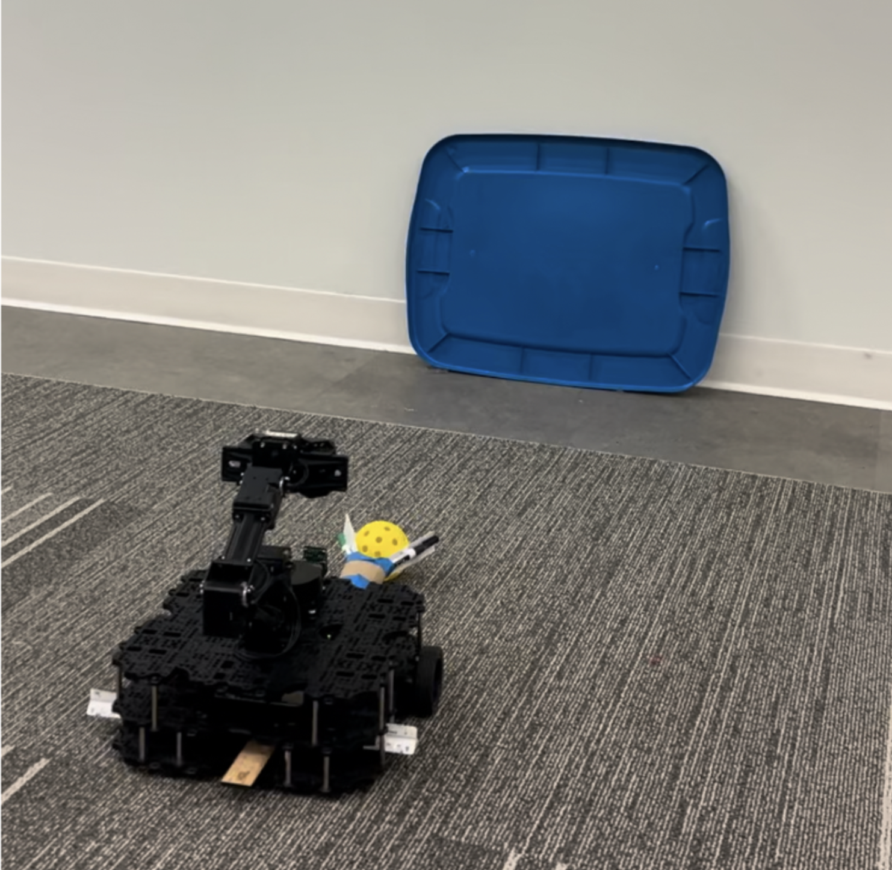

# Hi, I'm Giorgio Aversa

Aspiring full-stack engineer passionate about building tools that improve how people learn, work, and connect. I’ve worked across early-stage startups and university-backed research programs, leading technical development, managing program roadmaps, and shipping products to real users.

---

## 🧑‍💻 About Me

- Living in Chicago, getting 2 degrees in 2° weather
- Hobbies: Life long love of playing soccer and watching it (Liverpool), skiing, reading (fantasy!), and gaming
- Currently Learning: Spark, Kafka, and all about Big Data
- Outside of CS I enjoy studying philosophy, history, and language learning (한글)

---

## 🥞 Tech Stack

### Programming Languages  

### Frameworks & Libraries  

### Cloud & DevOps  

### Tools & IDEs  

## Projects

### [BrightBoost](https://github.com/Bright-Bots-Initiative/brightboost) — Team Lead Developer  
BrightBoost is a gamified web app for teachers and students to share lessons, track activities, and encourage engagement. Built with React, TypeScript, and Tailwind, the app uses AWS Lambda for its backend and Aurora PostgreSQL for persistent lesson and user data.
Role-based flows, JWT auth, and Cypress-tested features ensure a robust classroom-ready experience.

### [ConnectEd (Private Repo)]() — Lead Developer  
Social and emotional wellness and companion app to KindEd curriculum. Mobile app featuring daily check-in behavior logging, family/teacher connectivity, and chat features.

### [AVD JavaScript Data Visualizations (Private Repo)]()  

This project explores how certain data visualizations succeed—or fail—depending on changes in the **data** or its **representation**, following the framework of [Algebraic Vis Design (Kindlmann 2014)]((https://pubmed.ncbi.nlm.nih.gov/26356932/)). Each demo features a visual pair (VisLeft vs VisRight) highlighting a particular failure mode:

- **Hallucinator:** Superficial data ordering alters perceived insights
- **Confuser:** Meaningful changes are hidden or ambiguous
- **Misleader/Jumbler:** Changes misalign with visual interpretation

Each pair is interactively updated via a toggle button. Users are invited to explore how seemingly minor shifts in data or design can significantly affect what we see—and what we miss.

📁 Built with D3.js, custom data preprocessing in Pandas/Python, and manual visual diagnostics. All code is modularized across `partA.js`, `partB.js`, and `partC.js`.

#### Demo Preview

### [SoccerBot](https://github.com/Intro-Robotics-UChicago-Spring-2024/final_project_soccer_bot.git) — Vision-Based Behavioral Cloning for Goal-Scoring
SoccerBot is a vision-based robot control system that learns to score goals using behavioral cloning. Trained on expert demonstrations (teleop runs), the robot predicts linear and angular velocities directly from its camera feed — no LiDAR, localization, or classical planning required.
Built with PyTorch, ROS, and ResNet, the project showcases end-to-end imitation learning from raw images to real-world actions, including a learned "stop-at-goal" mechanism using cosine image similarity.

#### Demo Preview

### iOS Projects — [More Info (Private Repo)]()  

---

## Coming Soon

- Operating Systems Coursework 👀

---

## How to Reach Me

[Email](mailto:giorgioaversa3@gmail.com) • [LinkedIn](https://www.linkedin.com/in/giorgio-aversa-669661287)

> Some repos are private due to academic or company policies. Summaries and demo content available on request.
